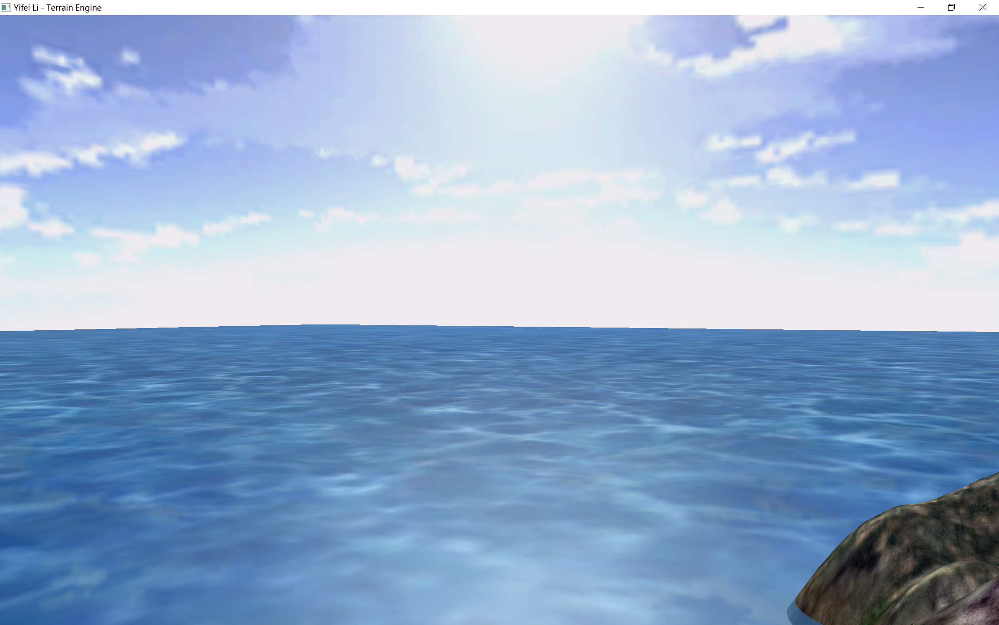

# Computer Graphics Project: Terrain Engine

> Yifei Li

## Description

Construct a 3D scene and wander in it. This terrain engine supports:

- Skybox, water, wave and reflection
- 3D terrain model with textures
- Controllable camera wanderring in the scene

Bonus features:

- Dynamic wave (tide effect)
- Phong model lighting (both terrain and water)
- Screenshot

## Environment

- Windows 10 Pro 20H2
- Visual Studio 2019 Community v16.9.3
- C++17
- OpenGL Core Profile 4.6
- Please set following environment variables to correctly build the VS project:
- `GLFW_HOME`: root dir of GLFW version 3.3.3 library
- `GLAD_HOME`: root dir of GLAD version 4.6 library
- `GLM_HOME`: root dir of GLM version 0.9.9.8 library
- `SOIL2_HOME`: root dir of SOIL2 version 1.20 library

**NOTE**: This project uses [SOIL2](https://github.com/SpartanJ/soil2) instead of SOIL lib. It is supposed to be able to be used interchangably with SOIL lib.

## Usage

If you open the VS solution in VS, just build and run. Otherwise, put the asset dir (`assets/`) and the shader dir (`shaders/`) into the same dir as the built `bin/Terrain-Engine.exe` executable, and then run the executable.

- Use W/A/S/D and mouse to control the camera.
- Press PRINT_SCREEN key to take screenshots.
- Press ESC to exit.

## Results and demo

***For a demo video, please refer to `demo/demo.mp4`.***

Here are screenshots:

An overview

Phong lighting effect of terrain model (note the lighting of the ridges and water)

Phong lighting effect of water model

## How it works?

### Modularity

The whole project is designed with modularity. The moving camera (the user) is encapsulated into the `Camera` class in `camera.hpp`. The scene is encapsulated into the `TerrainEngine` class in `terrain_engine.[h|cpp]`, containing terrain model, sky box and water. (Also, bonus features are included.)

### Shaders

Shaders are managed by the `Shader` class defined in `shader.hpp`. To automatically manage resources and avoid memory leakage, **`std::unique_ptr`** is adopted to contain the pointers of shaders. Besides, a new shader can only be generated with `Shader::Create` method, and raw constructors are disabled.

### Basic Terrain Engine

The terrain engine includes several components: the sky box, the terrain model, and the water.

#### Sky box

The sky box consists of 5 faces of a cube. To draw a sky box, just draw the 5 faces and map textures onto them. Besides, make sure to correctly scale the sky box to make the horizon seems more realistic. And the **perspective** of the camera should also be set properly to ensure the farthest cornor of the sky box inside the range of view.

#### Terrain model

The original height map is read with SOIL2 lib, and then it is **triangulated** into triangle faces. The normals can also be computed with SOIL2. To make it seem realistic, we map two textures onto the model: the overall texture and the detail texture.

To mix them up, there are multiple methods. Using the `mix` function supported by GLSL, the color seems somehow dark. So I chose to simulate the **`GL_ADD_SIGNED`** method supported in the old fixed-pipeline, which is adding two colors and minus 0.5. This makes the result seems more like the real terrain.

#### Water

Water is simplified to a square surface with texture mapping. To implement the wave effect of the water, we use a dynamic texture mapping. The texture coordinates are shifted as time passes. To make this shift more realistic, it is implemented in both X and Y direction. And **sin/cos** functions are adopted to smooth such movement as well as make the effect more realistic. What's more, there is a **phase difference** between X and Y texture coordinates, so that the wave moves in some relatively complicated pattern.

To implement the reflection effect, the terrain model and the sky box are mirrored. And the terrain under the sea level is **trimmed** with `discard` in fragment shader.

### Bonus features

#### Dynamic wave (tide effect)

The dynamic texture coordinates only make the wave "moves" on a plaine surface. However, in real world it moves in 3D space and there are **flood tides and ebb tides**. So we use a dynamic Y position coordinate to simulate this effect. The new Y coord $Y'$ of a vertex is computed as
$$Y'=Y+A(\cos(\alpha * time) + 1),$$
where $A$ and $\alpha$ are controlling factors. In this way, the tides go up and down frequently.

#### Phong model lighting (both terrain and water)

There is the sun up in the sky box, so there should also be lighting effect in the terrain engine. To make it realtime, **Phong model** is adopted. For both terrain and water, Phong model is implemented in fragment shaders and parameters are passed to the shaders in the drawing methods defined in the `TerrainEngine` class. To make the final color "lighter", `sqrt` is used for the final result of lighting.

#### Screenshot

The SOIL2 lib supports taking screenshots, so we just implement this function with the provided interface. To ensure the output path and avoid crashing the whole process, **`std::filesystem` in C++17** is adopted to easily make a screenshot directory if it does not exist.
